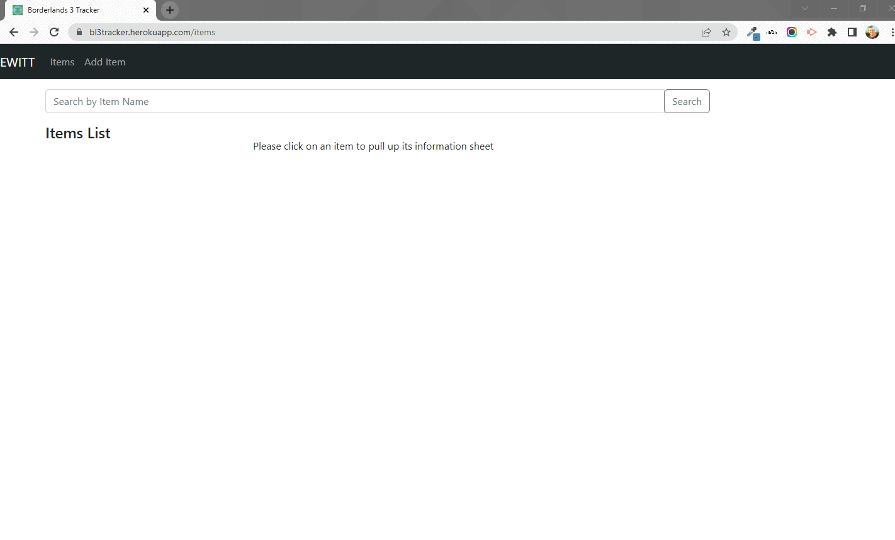
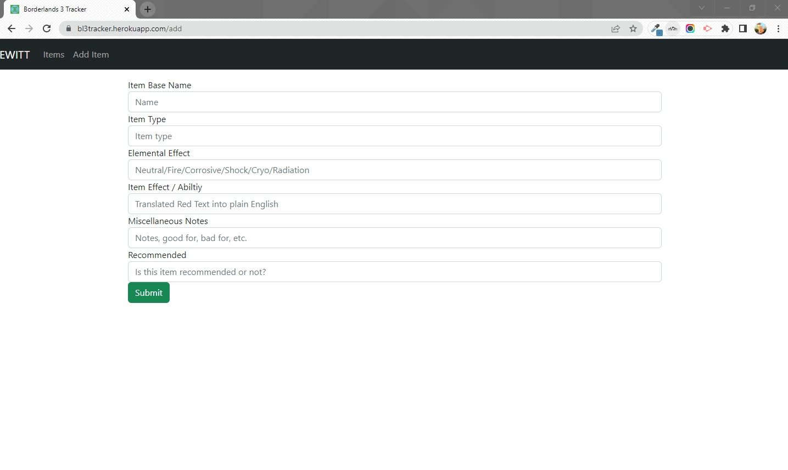
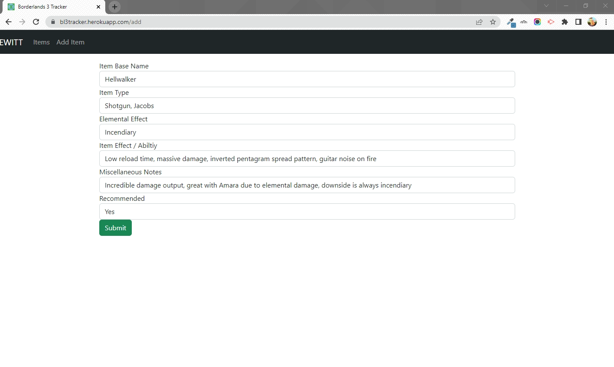

# Borderlands 3 Tracker


## Description

This is a website I created to help me manage and organize items that I've looked up in Borderlands 3. This game has a multitude of possible dropped loot variations, and as I play through, I often find myself looking up their abilities and trying to remember if I liked them or not on a previous playthrough. This app should allow me to spend less time googling and re-googling, and more time gaming!

This app is deployed through Heroku and can be found [HERE](https://bl3tracker.herokuapp.com/)

## Table of Contents 

* [Installation](#installation)

* [Usage](#usage)

* [License](#license)

* [GitHub Repo](#github-repo)

* [Contributing](#contributing)

* [Testing](#testing)

* [Questions](#questions-and-contact-info)

## Installation

To install necessary dependencies, run the following command in the console/command line:

```
npm i
```

## Usage

To begin running the program, run the following command in the console/command line:

```
npm run start
```

## License

This project is licensed under the MIT license. Learn more [HERE](LICENSE)

## GitHub Repo

https://github.com/ericwittenstein/Borderlands-3-Tracker

## Project Demo







## Contributing

Not currently accepting contributions

## Testing

To initiate the unit tests for this project, run the following command in the console/command line: 

```
npm run test
```

## Questions and Contact Info

If you have any questions about the repo, please open an issue on GitHub or contact me directly at [eric.wittenstein@gmail.com](mailto:eric.wittenstein@gmail.com).

You can find more of my work at [github.com/ericwittenstein/](https://github.com/ericwittenstein/).

<!-- EHW SIGNET
---------
    |
  -----
    |
---------
 -->

### Eric Wittenstein
